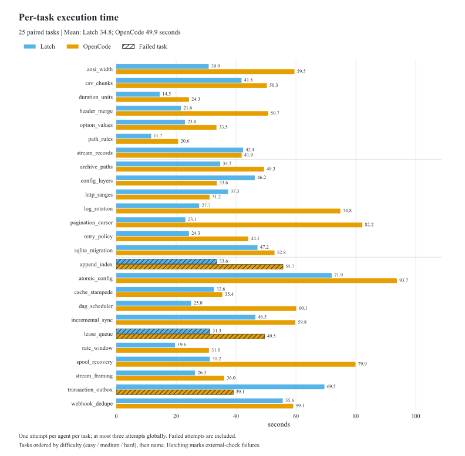
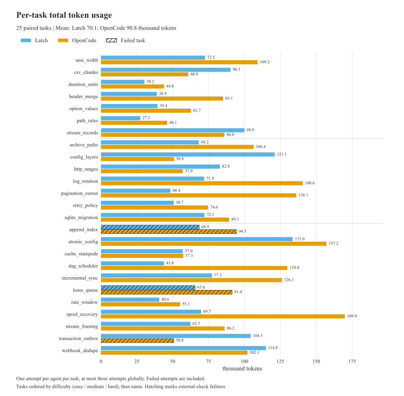
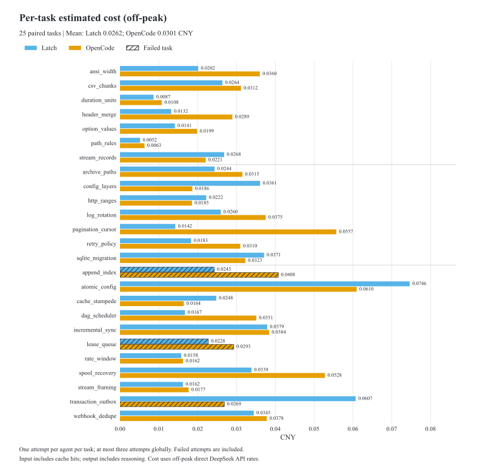

# Latch

Latch is a terminal coding agent for Linux and Windows. It keeps sessions on disk and runs commands inside a mandatory platform sandbox. The current version is 0.2.3.

[Website](https://jinshuo-li.github.io/latch/) · [Example configuration](config.example.toml) · [Report a problem](https://github.com/JinShuo-Li/latch/issues)

## Install

Install the latest precompiled release for x86_64 Linux or Windows; no Rust toolchain is needed.

**Linux (Bash)**

```sh
curl -fsSL https://jinshuo-li.github.io/latch/install.sh | bash
```

**Windows (PowerShell)**

```powershell
irm https://jinshuo-li.github.io/latch/install.ps1 | iex
```

The Windows installer leaves PATH unchanged. For the default install directory,
make `latch` available in the current PowerShell terminal and verify it:

```powershell
$env:PATH = "$env:LOCALAPPDATA\Programs\Latch\bin;$env:PATH"
latch --version
```

For future terminals, add `%LOCALAPPDATA%\Programs\Latch\bin` to your **user Path**
in Windows Environment Variables, then reopen PowerShell. Use your chosen
directory instead if you customized the install location.

Both installers require the release's SHA256 checksum and verify it before installing.
Latest-release lookup uses GitHub's public redirect; no API token is needed.
Linux installs to `~/.local/bin`; Windows installs to `%LOCALAPPDATA%\Programs\Latch\bin`.
Follow the installer's PATH instructions, then open a terminal in your project.
[Download releases](https://github.com/JinShuo-Li/latch/releases) or see the
[install guide](docs/INSTALL.md) for version pins, custom directories, and troubleshooting.
The Linux installer also supports older versioned release archives.

Linux needs glibc 2.35+, `bwrap` (Bubblewrap), `rg` (ripgrep), and Git on `PATH`.
Windows needs Git for Windows, ripgrep, and a user-owned NTFS workspace.
The native Windows sandbox is embedded in `latch.exe`; binary installs need no MSVC, WSL, or Git Bash.
See [Windows findings and current limits](docs/WINDOWS_DIAGNOSTICS.md) for workspace ACL, startup cost and local-server issues.
Latch refuses to run commands if its sandbox is unavailable.

**Build from source**

Install stable Rust and a C toolchain. On Windows, also install x64 MSVC C++ Build Tools and the Windows SDK.

```sh
git clone https://github.com/JinShuo-Li/latch.git
cd latch
cargo install --path crates/latch-cli --locked
```

## Get started

Open a terminal in your project and run:

```sh
latch
```

On first launch, use `/setup` to choose a provider, enter or reference its API key, choose a model, and save. Run `latch doctor` to check local prerequisites and configuration without contacting a model provider. `/model` changes the model for the current session. You can also run one prompt without the TUI:

```sh
latch -p "Explain this repository"
```

Resume a session with `latch --resume`. For scripts, use `latch run --workspace ./project --prompt "Fix the failing test" --output json`; `latch sessions list` shows saved sessions. Run `latch --help` for all options.
Latch asks the model to include its final summary when it marks a task complete;
the recorded validation determines whether that task is verified.
After recorded edits, a missing implementation claim also receives one bounded
correction opportunity; a normal CLI exit alone is not verified completion.
An empty final completion summary receives a kernel report of recorded changes
and current validation status without an extra model request.
When several requirements need fresh evidence, one validation command can
prove them together; older passes remain historical after later writes.
Linux validation preserves failures through output-filtering pipelines. On
Windows, run validation checks separately or redirect output instead of piping it.

## Web UI (Linux and Windows)

Use the English, dark-by-default browser interface with the same kernel,
durable sessions, tools, approvals, and sandbox as the TUI:

```sh
cd /path/to/project
latch --web                       # localhost:6006; opens the browser
latch --web --web-port 6007       # choose a local listener port
latch --web --ssh 6006            # remote listener; prints SSH instructions
```

The workspace stays fixed to the launch directory. On Windows, start from a
user-owned NTFS project directory; the embedded sandbox still applies. Conversations, streaming,
steering, model/settings controls, images, diffs and task details are connected
to Latch. Both interfaces show sidebar activity: waiting for the model,
reasoning when reported by the provider, writing, tools, approvals and stopping,
with elapsed time and time since activity. For remote use, forward with
`ssh -N -L 7000:127.0.0.1:6006 user@remote-host`, open `http://localhost:7000`,
and enter the token printed by the remote process.

Web support is available in source builds from current main; published v0.2.3
binaries predate it. See the [Web guide](docs/WEB_UI.md) for resume, controls and
connection details. The [review prototype](web/prototype/README.md) remains a
standalone example; the [integration plan](docs/WEB_UI_PLAN.md) records the scope.

## Working safely

`/mode` selects Ask, Plan, or Work. `/safety` controls which operations need approval; `/permissions` controls how approval requests are handled. Every command still runs inside the platform sandbox. Commands classified as inspection run with read-only filesystem access even in Work mode. `/help` lists TUI controls and commands.

The transcript shows messages and tool activity, with a session sidebar shown automatically on wide terminals. Ctrl+B opens or closes the sidebar. The input box keeps room for multiline editing, and the startup screen uses a small Latch title. Mouse capture is enabled by default so the wheel scrolls the composer and transcript instead of recalling input history, including under tmux and Zellij. In terminals that support it, hold Shift while dragging to select text. Set `LATCH_MOUSE_CAPTURE=0` before starting Latch to disable capture and restore native mouse selection; terminals or multiplexers may then translate the wheel into history-navigation keys. PageUp/PageDown and Shift+PageUp/Down remain available for scrolling.

On Windows, scoped file brokers let commands list, read and write ordinary workspace files without changing source ACLs or requiring `WRITE_DAC`. Runtime bootstrap and scratch grants still use durable recovery. Sensitive files with broad package permissions require recoverable sealing or fail closed. A whole live home directory remains unqualified. For a local clone, `git clone --no-hardlinks` avoids links to files outside the workspace. See the [Windows boundary status](native/windows/boundary/CURRENT_STATE.md) and [open issues](https://github.com/JinShuo-Li/latch/issues) for current limits.
With explicit Network authorization, sandboxed Windows tools can access loopback services and start local TCP/UDP listeners without firewall or loopback exemption changes.
PowerShell extensions require PowerShell 7; fixed headless calls use a staged runtime and default to MTA inside AppContainer.

## Benchmark results

In this 25-task run, **Latch passed 23/25 tasks** versus OpenCode's **22/25**,
with mean execution times of **34.78 s** and **49.92 s**, respectively.

DeepSeek V4.1 Flash · 6 October 2026 · Single attempt per task ·
[Full results and methodology](benchmark/reports/2026-10-06-full-comparison/README.md)

<picture>
  <source media="(prefers-color-scheme: dark)" srcset="benchmark/figures/2026-10-06/task-time-dark.svg">
  
</picture>

<picture>
  <source media="(prefers-color-scheme: dark)" srcset="benchmark/figures/2026-10-06/task-tokens-dark.svg">
  
</picture>

<picture>
  <source media="(prefers-color-scheme: dark)" srcset="benchmark/figures/2026-10-06/task-cost-dark.svg">
  
</picture>

## For contributors

Run `cargo fmt --all -- --check` and the platform tests before sending changes. The [architecture](docs/ARCHITECTURE.md), [runtime capability model](docs/RUNTIME_CAPABILITY_MODEL.md), [continuity design](docs/CONTINUITY.md), and [repository instructions](AGENTS.md) contain implementation details. Tag-triggered binary publishing is documented in the [release guide](docs/RELEASING.md). Linux release checks are in `scripts/release-gate.sh`; Windows native fixtures and recovery notes are in `native/windows/boundary/`.
The [Linux benchmark candidate suite](benchmark/README.md) runs isolated CLI coding tasks
against DeepSeek v4.1 Flash and records independent checks, tokens, cache reads,
and wall time. It is opt-in and uses a real provider credential.

Latch is independent software and has no runtime dependency on the upstream projects studied in `.references/`.
