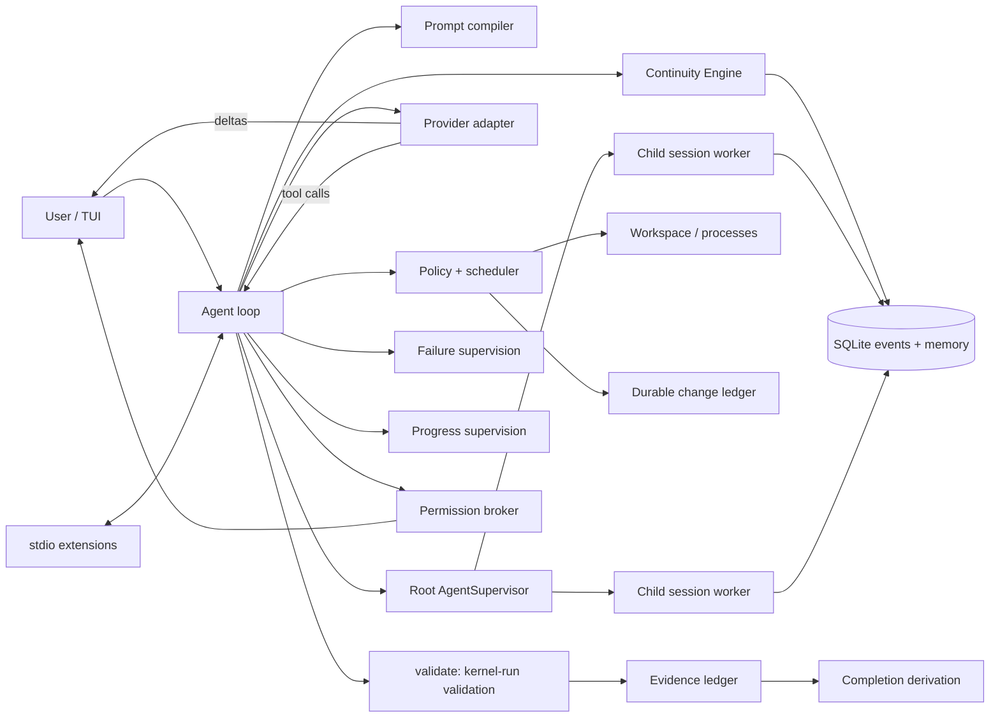

# Architecture

| Crate | Responsibility |
|---|---|
| `latch-protocol` | Events, task/memory/evidence records, provider and extension types, shared display formatting |
| `latch-kernel` | Store, continuity, prompts, policy, tools, providers, extensions, validation/evidence, failure and progress supervision, permissions, child-agent graph/workers, token estimation, loop, session resume |
| `latch-tui` | Typed transcript, slash palette, input editor, prompt history, semantic rendering |
| `latch-cli` | Configuration, resume orchestration, provider setup, slash-command coordination |

## Prompt architecture

`PromptCompiler` assembles the model-facing system prompt from prioritized
fragments. Stable coding-agent behavior comes first: identity, execution
(default to action, the implementation loop, completion discipline),
inspection focus, scope discipline, decision-making, tool semantics,
communication style, and the validation/stale/reground policies. Mode text
follows, then per-session context (canonical task state, workspace, repository
instructions). Only the stable fragments are marked cacheable; dynamic context
is never mixed into them. The compiled prompt is intentionally bounded and
covered by tests that pin the fragment order, forbid obsolete policy text, keep
Latch-specific tool/runtime guidance, and cap its size.

## Live steering

Each session has one agent loop and one conversation. While a run is in flight the
interactive layer keeps a `SteeringQueue` handle: submitted text is pushed
there in FIFO order and the TUI shows a single `steering queued` notice. The
queue is an atomic run-closing handshake. A run opens it at start; when the
model answers with plain text the loop atomically closes the queue and takes
everything accepted before that instant. If anything was accepted, the run
stays open and must consume it with another turn before it may exit; if
nothing was pending the run closes for good. A submission that loses the race
is rejected with a deterministic `Closed` outcome, is never enqueued, and the
interactive layer surfaces it as a new request instead of leaving it for a
later run. Aborted runs (Ctrl+C or a provider error) drop accepted-but-
unconsumed steers rather than leaking them; Ctrl+C semantics are unchanged.

The loop drains accepted messages only at safe model boundaries — after every
prior tool transaction has a terminal result and before the next
`ModelRequest` is constructed — and records each message as a normal durable
`UserMessage` with the same constraint-memory and extension-observation
provenance as an ordinary prompt. Injected turns therefore appear in the
volatile/append-only portion of the current context epoch, resume and replay
identically, and can never be placed between an assistant tool call and its
results. Newly drained steers become the retrieval query for the next
materialization (an ordered combination when several arrive together), so a
direction change can pull older session material into the volatile kernel
context tail; ordinary continuation turns keep no query and do not trigger
surprise recall.

A steer can also arrive while the model is executing an assistant turn that
proposed several sequential side-effecting calls. The in-flight call finishes
normally, but any not-yet-started side-effecting call is not blindly executed:
it receives a synthetic terminal result (`superseded by newer user steering`)
and the model re-plans under the newer instruction. Classification reuses the
safety capability set — only calls that the kernel already classifies as
pure workspace reads are allowed to proceed — and read-only calls that were
already started concurrently may finish. Every tool call still has exactly one
terminal result, and cancellation stays separate: Ctrl+C cancels the run,
while steering never touches the in-flight request, tool, or managed process.

## Durable child-agent graph

The root `AgentSupervisor` owns an agent graph and independently spawned async
workers; the root `Agent` never stores child `Agent` values. A child id is its
durable session id. `AgentSpawned` is the first event in that session and is
committed in the same SQLite transaction as session creation, carrying the
root/parent relationship, name, optional type, depth, and compact delegation
brief. Status, queued/delivered messages, reports, interrupt, and close are
append-only child-session events. Graph replay reduces those events in stable
name/id order. A persisted `Starting` or `Running` state with no surviving
runtime is reconciled once to `Interrupted`; it is never rerun implicitly.

The model-facing schema is fixed: `spawn_agent`, `send_agent_message`,
`continue_agent`, `wait_agents`, `list_agents`, `interrupt_agent`, and
`close_agent` exist regardless of graph contents. Spawn is asynchronous;
queue-only messages do not wake an idle child, while continue starts a turn or
uses the child's steering queue at its next safe boundary. `wait_agents`
returns statuses only — report bodies travel on exactly one channel, the
durable kernel notification delivered with the request that reads the wait
result. Interrupt cancels a turn but retains the worker/mailbox. Close
cancels, waits for resource release, and records the terminal lifecycle. Root
shutdown closes all live workers. A child whose worker restarts still owes its
opening turn: an undelivered delegation brief is replayed from `AgentSpawned`
ahead of any follow-up. Depth is limited to one, so a child receives the
stable tools but every agent control call fails with a normal terminal tool
result.

Child context begins fresh: its first user turn is the delegation brief, and
its system prompt independently loads workspace repository instructions. Task
state, evidence, failure and progress supervision, continuity, and cache epochs
are reconstructed solely from that child session. `AgentReport` exposes only
semantic evidence references; it never imports evidence into the parent ledger.
All executors share the root workspace mutation/ownership coordinator and the
live root policy locks as a capability ceiling, but processes, grants, and
permission brokers remain session-local. OpenAI-compatible transports that use
session metadata are cloned with the child id, preserving OpenCode Go's stable
`x-opencode-session` behavior.

Workers never append provider-visible events to the parent asynchronously.
They queue compact reports in the supervisor; the root loop drains them only
before constructing a model request or after a plain assistant answer, when all
prior tool calls already have terminal results. It then appends
`AgentNotificationDelivered`, the sole graph event visible to parent context
and the durable resume dedupe marker; the TUI renders it as one quiet
transcript line. Internal graph/mailbox events are also excluded from FTS
recall.

## The validation shift: models express intent, the kernel owns truth

The model names what must hold — `validate {"requirement": "existing unittest
passes", "command": "python3 -B -m unittest test_calc -v"}` — and the kernel
does everything else: it executes the command under shell policy, appends a
`ValidationResult` event, creates or supersedes evidence for the requirement
with the real source event recorded internally, registers the requirement, and
derives completion. The model never supplies or sees an internal event id,
call id, or ledger id. `record_evidence` remains for non-command claims but
accepts only `pending` and `unavailable`; `passed`/`failed` statuses are
kernel-owned, so a model cannot self-certify.

Evidence is a current-state ledger: the newest entry per claim is the current
evidence; earlier entries stay in durable history. A validation that failed and
now passes supersedes the failure. Completion is derived, never declared:
`InProgress` until the model claims implementation, then `Verified` when every
required validation has current passing evidence, `Blocked` when a required
validation is unavailable, and `ImplementedNotVerified` otherwise.

## State, memory, and supervision

Model `task_update` constraints are `TaskConstraint` memory; only actual user
messages create `UserConstraint` provenance. Hypotheses are rejected or stay
hypotheses — a rejected hypothesis is never promoted to a decision. Decisions,
task constraints, and open questions have deterministic supersession/resolution
so canonical current state stays clean while raw events and memory records
retain history.

Failure supervision tracks a streak per validation lineage (requirement, or
shell command). Successful inspection tools never reset it; the lineage's own
validation passing resolves it, and a materially different failure signature
restarts the count. Streaks replay from durable events, so `--resume` does not
forget a stalled loop. At the configured budget the kernel requests re-ground.

Progress supervision is separate and deterministic: every read_file, search,
read_artifact, git_status, git_diff, and conservative read-only shell
observation is keyed by canonical subject (including range arguments) plus
result digest, scoped to a progress epoch. Workspace mutations (Latch, shell,
or detected external), new validation/evidence, meaningful task-state changes,
mode switches, and new user turns advance the epoch, so legitimate re-reads
after real change are never confused with redundancy. Consecutive turns that
only repeat unchanged observations cross the stagnation budget, at which point
the kernel injects a re-ground instruction listing exactly what is already
known; repeats after that are suppressed with a synthetic terminal result
instead of spending a tool cycle. Supervision state replays from durable
events, so live and `--resume` behavior are identical.

There is no fixed model-turn ceiling. `failure.max_model_turns` is an optional,
off-by-default circuit breaker for operators; long productive tasks are
governed by the stagnation and failure supervisors, not by count.

Important lifecycle transitions append to SQLite. Streaming token deltas are
transient. Operations are marked running before execution and complete
afterward; resume surfaces an unfinished record as uncertain.

Read-only batches execute concurrently. A mutation lock serializes edits,
writes, checkpoints, and undo. Shell and validation processes use bounded
timeout, cancellation, captured status, and artifact spill for large output.
Managed `exec_*` processes are owned by the kernel, buffered in memory, spilled
to artifacts past a cap, and durably closed with `ProcessExited`; a resumed
session reports honestly that children did not survive the restart.

## Context budgeting

Context is token-native. `latch-kernel::tokens::TokenEstimator` is a
conservative, provider/model-aware estimator (ASCII ~4 chars/token,
punctuation ~2, wide CJK/emoji characters priced explicitly); all pre-request
numbers are estimates, and provider-reported usage is authoritative after a
request. `ContextStats` records instructions, canonical state, recent
transcript, recall, tool schemas, and extension context, plus the model's
context window, reserve, and headroom. The context window defaults to 256k
tokens and is overridable per model (`[models.<name>] context_window_tokens`).
The continuity engine receives a `MaterializeBudget` that already subtracts
tool/extension costs, and the agent recomputes totals from the exact
components, so recalled material is counted once.

Recent estimation prices the provider-facing shape: tool-call arguments and
replayed `reasoning_content` are included, kernel bookkeeping events are not.
`ContextStats.request_tokens` is measured on the exact assembled request
(system, messages, tool schemas) after any extension transform, and
`ContextStats.common_prefix_tokens` is the byte prefix shared with the
previous request under Latch's canonical serialization and token estimator.
Their ratio is the **estimated architecture cacheability**: a Latch
architecture diagnostic, not a provider measurement. When provider usage is
known, `provider prefix utilization = cache_read_tokens /
common_prefix_tokens` shows how much of that estimated prefix the provider
actually reused, and the **measured provider cache hit rate** is
`cache_read_tokens / (cache_read_tokens + cache_miss_tokens)` from
provider-reported categories. Unknown categories stay unknown rather than
being fabricated. The sidebar labels all three distinctly and also shows the
current cache epoch generation, its conversation span, the last rotation
reason, and the tokens retained by that rotation.

### Prompt cache layout

The compiled system prompt is session-stable by construction: core
instructions, policy, mode, workspace identity, and repository instructions.
Canonical task state is rendered exactly once by continuity and travels as a
final kernel-context user turn together with recalled originals and extension
context, so frequently changing state/evidence never invalidates the reusable
prefix. Tool schemas are stable and serialized before the messages. The
request signature is `system + tools + messages`, so within an epoch each turn
extends the previous request rather than rewriting it. The Anthropic adapter
merges that kernel-context turn into the preceding user message to keep roles
alternating; it also marks the system block as an ephemeral cache breakpoint
(an adapter-only control), while OpenAI-compatible endpoints rely on automatic
prefix caching.

### Cache epochs are performance boundaries, not memory boundaries

The provider-visible conversation is organized into durable **cache epochs**.
Within one epoch every request is an exact append-only extension of the
previous one: no already-sent message is removed, reordered, or rewritten. The
system prompt and tool schemas are session-stable, and kernel-owned context is
sent as durable [`KernelContext`] messages instead of a synthetic trailing
turn, so the reusable prefix does not break on ordinary turns.

A new epoch starts with a complete authoritative `KERNEL STATE SNAPSHOT`.
During the epoch the kernel appends deltas only when something materially
changes: a state update carrying the complete current canonical state at a
higher revision, an extension-context update, recalled original events, an
archival index update, or a re-ground instruction. Revision numbers make
supersession explicit: the highest revision of the current generation is
current truth; earlier revisions are retained provenance. Kernel messages from
older generations stay in the raw log but are not part of the provider-visible
epoch.

Rotation is deliberate and hysteretic. The `recent_tokens` configuration is
the conversation high-water mark; when an epoch exceeds it, one rotation keeps
the newest whole semantic units up to roughly three quarters of the budget and
emits a fresh snapshot, leaving a quarter-budget of growth headroom so a
saturated session rotates occasionally rather than every turn. Tool
transactions are never split, an oversized unit is kept whole, and
`/compact` is an explicit reset that starts a fresh epoch. Rotation never
deletes memory: evicted material stays in the event log, remains reachable
through FTS recall, and remains visible through the archival episode index.

Canonical task state stays authoritative. The append-only kernel history
exists to preserve both provenance and cache locality, never to replace the
state system: goal, constraints, decisions, supersession, hypotheses,
questions, actions, validation requirements, evidence, failure lineages, and
completion remain durable and are re-rendered into every snapshot.

Cache reuse may be sacrificed whenever semantic continuity requires it. If
current truth would be crowded out, if a transaction would be split, or if
unresolved work would be hidden, the epoch rotates (or grows) even though the
prefix changes.

### Incremental history access

Every raw event is retained in full; only *how* history is queried is
incremental. `EventStore` exposes narrow, indexed reads used by the hot
paths: `last_sequence` for watermarks, `events_after`/`events_before`/
`events_between` for bounded ranges, `events_tail` for bounded recent loads,
`events_of_kinds` for targeted replay (approvals, failed tool lineages, change
ownership, process starts), and `latest_event_of_kinds` for compact
boundaries. `search_events` retrieves FTS-matched rows directly instead of
loading and filtering the whole transcript, preserving the bounded FTS
selection order (insertion order) before the bookkeeping-kind exclusion, so the
same durable log always yields the same recall material.

Live supervision keeps sequence cursors, so each turn feeds only newly
appended events to the progress supervisor and the live sink. Equivalence and
stress tests assert that incremental episode indexing equals a full rebuild at
every prefix and that a new turn over a large history reads only the working
set and the new delta.

## Durable transitions fail closed

Event persistence is the source of truth: a transition that must survive resume
never appears successful in live state unless its durable event committed.
Terminal tool results, kernel task-state updates, evidence, completion, and
permission resolutions propagate persistence failures and abort the run instead
of silently continuing. Evidence is persisted before it enters the live ledger,
and completion is remembered only after its durable announcement. Auxiliary
work — AI permission review, retry backoff, provider transport, and extension
RPCs — obeys the run's cancellation token, so Ctrl+C is never pinned by a
secondary call.

## Source layout

The kernel keeps its stable public types and the run loop in `agent.rs`, with
one child module per responsibility: `steering`, `request`, `permissions`,
`dispatch`, `agent_controls`, `kernel_tools`, `validation`, and `supervision`.
Root graph/runtime ownership lives in `agents/{supervisor,worker,graph,mailbox,
profile}.rs`. Tools keep the
`ToolExecutor` facade in `tools.rs` and split `policy`, `ownership`,
`process`, `files`, `write`, and `git` into children. The continuity engine is
a single module because rollover, episode segmentation, and recall share one
invariant. The TUI keeps the app state and reducer in `lib.rs` with
`transcript`, `markdown`, `chrome`, and `runtime` alongside the existing
`composer`, `sidebar`, `diff`, `presentation`, and `session_picker` modules.
Child modules are children of their owner, so private state stays private while
each file owns one concern.

## Usage and cost

`Usage` keeps provider-reported categories distinct: total input, output,
cache read, cache write, and a normalized cache miss, each optional with
`None` meaning unreported. OpenAI/DeepSeek-style usage includes cache hits in
`prompt_tokens`, so the adapter records the explicit miss or derives
total-minus-hit; Anthropic reports uncached input directly as the miss. Cost
bills uncached input at the normal input price plus cache reads and writes at
their own prices, so cached tokens are never double-charged. Unknown
categories stay unknown rather than being guessed, and an estimate that
depended on an unreported category is marked partial.

## Mode, Safety, Permissions, and the capability sandbox

Three orthogonal controls compose into one pipeline:

1. **Mode** (`ASK`/`PLAN`/`WORK`) gates whether mutation is eligible at all.
2. **Safety** (`Strict`/`Standard`/`Autonomous`) maps the classified
   capabilities of a call to `Allow`/`Ask`/`Deny`.
3. **Permissions** (`AutoApprove`/`Human`/`AiReview`) resolves an `Ask` through
   a durable request/resolution pair and a single-use `CapabilityGrant` keyed
   by kernel call id — never model-supplied.

`safety::classify` owns capability classification: workspace read/source/
metadata writes, Git metadata, external filesystem writes, network, remote side
effects, privileged and destructive operations, extension execution, and
unknown capabilities. External writes, Git metadata mutation, network, and
remote side effects always classify as `Ask` first, even under Autonomous +
All approved; hard deny (privileged/system-destructive) is independent of both
profile and resolver and cannot be granted. Explicit capability requests
(`capabilities: ["network"]`) are parsed from tool arguments; unknown names
become `UnknownCapability` -> `Ask`.

`AiReview` is a separate stateless provider call with no conversation history
and no tools. It receives a short task summary, workspace, the exact command,
the requested capability, and the escalation reason, and must answer strict
JSON `{risk, reason}`. `low` approves; `medium`/`high`/`critical` reject with
the one-sentence reason returned to the coding model; unparseable output
rejects conservatively. Non-command asks use human resolution rather than
fabricating a bash judgment.

### Mandatory Bubblewrap sandbox

`SandboxRunner` is the only way any command starts. The startup probe verifies
`bwrap`, unprivileged user namespaces, bind mounts, and the required namespace
set; failure is stored as an actionable refusal and shell/exec/validation/git
inspection all fail rather than running unsandboxed. A `SandboxProfile` binds
the host root read-only, mounts the workspace explicitly (read-only for
inspection; writable with `.git` remounted read-only unless `GitMetadataWrite`
was granted), adds call-scoped external writable roots, provides private tmpfs
`/tmp` and `/run`, masks home credentials, clears the environment, and isolates
user/PID/IPC/UTS namespaces plus network (re-shared only when the profile
grants it). Kernel-internal bookkeeping (`git status`, drift snapshots) also
runs through the sandbox for model-visible calls; host-side drift bookkeeping
uses fixed read-only Git commands. Extension hosts start through the same
sandbox with a read-only workspace and network; their individual tool arguments
remain a cooperative boundary, documented rather than overclaimed.

Non-interactive sessions record `non_interactive` denials; resume marks
unresolved requests `resume_expired`, and `SafetyChanged`/`PermissionsChanged`
events restore the exact policy the session ended with.

## Change ledger and shell drift

Latch- and shell-owned changes persist across restarts: pre-change bytes go to
content-addressed artifacts referenced by `FileChanged` events, and
`ChangeReverted` tombstones keep a resumed ledger from re-applying undone
work. `/undo` peeks before popping, restores only when the file still matches
the recorded post-change hash, and refuses otherwise. Guarded edits check the
`base_hash` against the current bytes, but drift onto a hash Latch itself wrote
is recognized as self-authored, so read → edit → repair works without a forced
re-read; only genuinely external modification trips the stale path. Workspace drift around
shell commands is classified honestly: Git workspaces get reversible `Shell`-owned
records where pre-content was capturable (captured dirty files, or the HEAD
blob for previously clean files) and explicit non-reversible markers otherwise;
non-Git workspaces get an honest "detection unavailable" marker. Pre-existing
dirty work is captured at startup and never conflated with Latch's changes.

## Providers

OpenAI-compatible chat completions and Anthropic Messages translate only at the
API boundary. Durable state remains provider-neutral. Assistant reasoning
(`reasoning_content`) is persisted and replayed verbatim by reasoning-capable
endpoints (DeepSeek, OpenCode Go) through a small wire profile; replay is
decoupled from tool-call structure so a defensive history transform can never
drop required reasoning state. Reasoning is never displayed in the transcript.
Repository instruction precedence is `CLAUDE.md`, `AGENTS.md`, then
`.latch/instructions.md`; current user input follows them. Kernel invariants
override project text.

## TUI state surfaces (V3.1)

The transcript explains activity; a responsive right sidebar explains state.
The sidebar reducer (`latch-tui::sidebar`) consumes the same durable events as
the semantic transcript, so live and resumed sessions agree: `ContextStats`
for the bounded working set, `TaskStateUpdated`/`EvidenceCreated` for
kernel-owned completion, `ModelUsage` for provider-neutral input/output and
optional cache categories (unknown stays `—`), and
`FileChanged`/`ChangeReverted`/`ExternalFileChangeDetected`/`ShellMutationObserved`
for Latch / Shell / Extension / External ownership. Optional user-configured
`[models.<name>.pricing]` yields a clearly labeled estimated cost; missing
components stay unavailable. The kernel forwards tool-appended durable events
to the live sink so live and replay observe identical event order.

The composer (`latch-tui::composer`) is a real editor rather than a text field:
the complete buffer is wrapped into grapheme-safe visual rows, an independent
viewport offset tracks the visible window, and the terminal cursor is placed
only while its visual row is visible. PageUp/PageDown move through an
overflowing prompt and fall back to transcript scrolling when it fits; the
wheel routes by pointer position. Layout chrome (footer, spacer, hints, gap,
metadata) drops before the editor body shrinks, so the prompt stays usable on
narrow or short terminals.

Diffs are first-class: `git_diff` completions become a typed
`DiffDocument` (parser in `latch-tui::diff`) rendered with restrained semantic
colors. Red/green semantics only ever apply inside a parsed unified diff;
unparsed input falls back to raw, uncolored lines. `/diff` opens a full-width
inspector with independent scrolling, temporary sidebar collapse, and a raw
toggle. A sidebar is shown at ≥110 columns (roughly 24–32%, clamped 28–44),
toggles with Ctrl+B or `/sidebar`, and collapses cleanly on narrow terminals.

## Resume

`--resume` is a user-level resume: the visible transcript replays from durable
events through the same formatter the live TUI uses (no reasoning, context
statistics, model usage, or raw task state), the effective mode resolves as
CLI `--mode` > the session's durable mode history > config default, prompt
history is rebuilt from user events, and task state, evidence, failure
streaks, progress supervision, and change ownership are restored without
re-executing anything or appending duplicate durable events. When the original
user prompt rotates out of the recent byte budget, the transcript is anchored
with a deterministic kernel continuation message rather than dropped, so a
mid-task window never gives the model amnesia.

## Testing and CI

Testing follows two principles. **Memory decides what the model needs to know;
cache decides how cheaply we can send it** — correctness and long-horizon
continuity outrank cache locality. **CI protects what Latch must never stop
being. Local tests verify that the current implementation actually works.**

CI is a small, stable architectural gate: `cargo fmt --all -- --check`,
`cargo clippy --workspace --all-targets --all-features -- -D warnings`, and the
deliberately selected invariant tier in
`crates/latch-kernel/tests/invariants.rs`. That tier is fast and deterministic
by construction — no `bwrap`, `rg`, `python3`, network, timing, or large
histories — and pins durable history as the source of truth, append-only cache
epochs that are not memory boundaries, canonical-state authority, the absence
of hidden destructive compaction, resume equivalence, kernel-owned
validation/evidence, safety hard-deny, steering protocol correctness,
deterministic provider serialization, and cache-accounting semantics.

Detailed correctness (providers, sandbox/command execution, snapshots,
extensions) runs locally with `cargo test --workspace`, and long-session /
large-history stress tests (`cargo test -p latch-kernel --lib continuity --
--nocapture`) stay out of CI by convention. Tests are not moved between tiers
merely to make CI green, and passing CI alone is not sufficient for a
substantial change.
