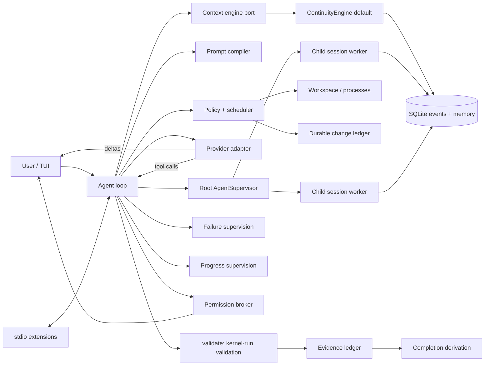

# Architecture

| Crate | Responsibility |
|---|---|
| `latch-protocol` | Events, task/memory/evidence records, provider and extension types, shared display formatting |
| `latch-kernel` | Store, context-engine port, continuity, prompts, policy, tools, providers, extensions, validation/evidence, failure and progress supervision, permissions, child-agent graph/workers, capability vocabulary, token estimation, loop, session resume |
| `latch-tui` | Typed transcript, slash palette, input editor, prompt history, semantic rendering |
| `latch-cli` | Configuration, resume orchestration, provider setup, slash-command coordination |

The runtime platform model — kernel invariants extensions can never bypass,
replaceable ports, the capability vocabulary, transport independence, and the
implemented-versus-deferred port map — is
[`RUNTIME_CAPABILITY_MODEL.md`](RUNTIME_CAPABILITY_MODEL.md).



## Providers and inference profiles

`ResolvedPaths` (`kernel/src/paths.rs`) owns configuration and storage path
discovery. New installations use a private `~/.latch/` root for config,
secrets, SQLite sessions, artifacts, and regenerable cache data. When the new
config is absent, an exact live XDG config is read in place. The explicit
`latch migrate` command copies the SQLite database with SQLite's backup API
and copies artifacts and secrets before publishing the new config. It writes a
migration marker and renames legacy config and secrets to backup names so
deleting the new config cannot reactivate the old installation.
Setup saves validate the proposed provider profile before writing. Config and
secrets are staged in their destination directories and synced; a new secret
is committed before config publishes its `file:<id>` reference. A failed
config commit can leave an unused secret, while a failed secret commit leaves
the previous config in place.
Validation checks provider ids, HTTP(S) URLs, symbolic credential syntax,
provider defaults, model selections, and positive context windows. Credential
parse errors omit the supplied value so a pasted key cannot enter diagnostics.

Provider handling is a layered subsystem, not a set of endpoint conditionals:

```text
Provider configuration      [providers.<id>] + legacy [provider]
        -> Provider capabilities
        -> Model catalog / metadata
        -> InferenceProfile     provider + model + reasoning effort
        -> Agent runtime
        -> Provider adapter     OpenAI-compatible / Anthropic wire format
```

`ProviderRegistry` (`kernel/src/providers.rs`) owns provider instances, the
built-in catalog, user metadata merging, effort capability resolution, alias
resolution, and provider construction. Precedence for model metadata is
explicit user configuration > built-in catalog > conservative default; an
optional `enabled_models` list filters the offered catalog without becoming
metadata, while per-model config tables store sparse user overrides. An
unknown model gets no invented context window, pricing, cache shape, or
reasoning parameters. `ProviderConfig` entries carry a symbolic credential
reference (`env:NAME`, `file:NAME`, `keyring:NAME`), and
`providers.<id>.default_model` selects a model when switching provider;
`[inference]` is the new-session default, seeded only when absent or invalid.
The live session profile is durable in the event log and never writes either
default back to config. `kernel/src/credentials.rs` resolves credential
references at process start from the environment
or a `0600` local secrets file. Secret values never enter the config file, the
durable event log, the model context, the transcript, or ordinary logs, and
provider error bodies are redacted.

`InferenceProfile` is provider-neutral and credential-free. The agent holds the
effective profile; `Agent::set_inference_profile` swaps the provider adapter,
model, token estimator, context window, pricing metadata, and reasoning-replay
policy together, resets architecture prefix accounting, and appends a durable
`InferenceProfileChanged` event. Continuity observes that event and starts a
fresh cache epoch with the reason `inference profile changed`, so provider
cache locality is never claimed across incompatible wire semantics. Resume
restores the last durable profile but resolves credentials freshly. A child's
effective profile is pinned durably in its own session at spawn
(`InferenceProfileChanged`, reason `inherited from root at spawn`); worker
recreation and process resume rebuild the child from that record, while a new
child inherits the root's current profile. Reasoning effort is emitted on the
wire only when the resolved model capability advertises the selected value
(the neutral set is `none`/`minimal`/`low`/`medium`/`high`/`xhigh`/`max`, but
each model exposes only its documented subset); otherwise the adapter sends no
effort field.

Transport is a per-model capability: OpenAI reasoning models use the
Responses API (stateless `store: false` replay with
`reasoning.encrypted_content`, captured from the response stream into the
durable assistant event and echoed back exactly once), Anthropic models use
Messages with adaptive thinking and exact thinking/redacted-block replay,
DeepSeek uses Chat Completions with explicit `reasoning_effort` and the
`thinking` toggle, and OpenCode Go resolves transport and reasoning efforts per
model from its documented list.
OpenCode Zen uses the same existing adapters for its documented Responses,
Messages, and Chat Completions models at `https://opencode.ai/zen/v1`; Go's
stable session header stays Go-only. The Zen transport list follows
https://opencode.ai/docs/en/zen/ and excludes Gemini until its adapter is
implemented. Run boundaries are durable (`RunStarted`/`RunCompleted`), so per-run accounting is
explicit while session totals remain cumulative.

The TUI consumes a provider-neutral catalog from the CLI for `/model` and
`/setup`; it never inspects base URLs, model families, or wire parameters.
`configuration_center.rs` owns the provider-list navigation state and emits
actions for Add, Credential, Models, Default model, Advanced, new-session
default, and Remove. It holds only symbolic credential references and display
statuses; the CLI/kernel owns resolution and persistence. The CLI sends
`SetupProviders` rows with credential and model readiness, and refreshes them
after setup changes. The TUI renders the rows through the existing windowed
choice surface.
Known providers use `KnownProviderFlow` under the configuration center: it
collects a credential, enabled model selection, and a provider default before
Save. The plan carries selections only; catalog metadata stays in the kernel.
Endpoint and effort controls are absent from this normal path.
Configuration may come from the interactive flows, `config.toml`, or CLI
overrides, with precedence CLI/session override > durable session profile >
user config > built-in defaults.

## Prompt architecture

`PromptCompiler` assembles the model-facing prompt from prioritized fragments
and splits it into a session-independent system prefix (the cacheable
behavioral core and kernel semantics) and a session context (workspace,
repository instructions, mode). The agent passes the prefix as the provider
`system` field and renders the session context as the first provider-visible
message, so the `system` + tools prefix is byte-identical across sessions and
mode switches and stays in the provider's prompt cache. The architecture
follows publicly documented Codex CLI prompt
structure (small behavioral core, explicit autonomy-and-persistence and
validation sections) and Anthropic's official proportional-effort guidance
(skip planning for straightforward work, verify with the narrowest meaningful
check, delegate only parallelizable work).

The stable prefix is a small behavioral core, in order: `core.identity`,
`core.general`, `core.effort`, `core.scope`, `core.planning`, `core.tool_use`,
`core.editing`, `core.validation`, and `core.communication`. Latch kernel
semantics follow: `latch.kernel_truth`, `latch.context_and_staleness`,
`latch.permissions`, and `latch.subagents`. Mode text (`mode.ask`,
`mode.plan`, `mode.work`) and per-session context (`environment.workspace`,
`environment.instructions.*`) come last.

Effort is proportional. Simple, local work inspects only what it touches, makes
the smallest coherent change, runs the narrowest meaningful check, and stops
once the requested behavior is directly demonstrated. Standard work completes
the requested scope with targeted validation and broadens only on evidence.
Complex or long-horizon work may plan, inspect dependencies, validate broadly,
and delegate independent work. The stopping rule is explicit: stop at direct,
relevant evidence instead of searching for extra confidence, unrelated defects,
or cleanup. The continue-until-done rule lives in exactly one fragment
(`core.effort`) so persistence never competes with the stop rule.

Only the stable fragments are cacheable; dynamic context is never mixed into
them. The compiled prompt is intentionally bounded and covered by tests that
pin the fragment order, forbid obsolete blanket-persistence text, keep
Latch-specific tool/runtime guidance and kernel semantics, and cap its size
(the cacheable static prefix is pinned by a test cap of 1,329 estimated tokens;
the session and mode fragments are ordered after it and are not counted).

## Live steering

Each session has one agent loop and one conversation. While a run is in flight the
interactive layer keeps a `SteeringQueue` handle: submitted text is pushed
there in FIFO order and the TUI shows a single `steering queued` notice. The
queue is an atomic run-closing handshake. A run opens it at start; when the
model answers with plain text the loop atomically closes the queue and takes
everything accepted before that instant. If anything was accepted, the run
stays open and must consume it with another turn before it may exit; if
nothing was pending the run closes for good. A submission that loses the race
is rejected with a deterministic `Closed` outcome, is never enqueued, and the
interactive layer surfaces it as a new request instead of leaving it for a
later run. Aborted runs (Ctrl+C or a provider error) drop accepted-but-
unconsumed steers rather than leaking them; Ctrl+C semantics are unchanged.

The loop drains accepted messages only at safe model boundaries — after every
prior tool transaction has a terminal result and before the next
`ModelRequest` is constructed — and records each message as a normal durable
`UserMessage` with the same constraint-memory and extension-observation
provenance as an ordinary prompt. Injected turns therefore appear in the
volatile/append-only portion of the current context epoch, resume and replay
identically, and can never be placed between an assistant tool call and its
results. Newly drained steers become the retrieval query for the next
materialization (an ordered combination when several arrive together), so a
direction change can pull older session material into the volatile kernel
context tail; ordinary continuation turns keep no query and do not trigger
surprise recall.

A steer can also arrive while the model is executing an assistant turn that
proposed several sequential side-effecting calls. The in-flight call finishes
normally, but any not-yet-started side-effecting call is not blindly executed:
it receives a synthetic terminal result (`superseded by newer user steering`)
and the model re-plans under the newer instruction. Classification reuses the
safety capability set — only calls that the kernel already classifies as
pure workspace reads are allowed to proceed — and read-only calls that were
already started concurrently may finish. Every tool call still has exactly one
terminal result, and cancellation stays separate: Ctrl+C cancels the run,
while steering never touches the in-flight request, tool, or managed process.

## Durable child-agent graph

The root `AgentSupervisor` owns an agent graph and independently spawned async
workers; the root `Agent` never stores child `Agent` values. A child id is its
durable session id. `AgentSpawned` is the first event in that session and is
committed in the same SQLite transaction as session creation, carrying the
root/parent relationship, name, optional type, depth, and compact delegation
brief. Status, queued/delivered messages, reports, interrupt, and close are
append-only child-session events. Graph replay reduces those events in stable
name/id order. A persisted `Starting` or `Running` state with no surviving
runtime is reconciled once to `Interrupted`; it is never rerun implicitly.

The model-facing schema is fixed: `spawn_agent`, `send_agent_message`,
`continue_agent`, `wait_agents`, `list_agents`, `interrupt_agent`, and
`close_agent` exist regardless of graph contents. Spawn is asynchronous;
queue-only messages do not wake an idle child, while continue starts a turn or
uses the child's steering queue at its next safe boundary. `wait_agents`
returns statuses only — report bodies travel on exactly one channel, the
durable kernel notification delivered with the request that reads the wait
result. Interrupt cancels a turn but retains the worker/mailbox. Close
cancels, waits for resource release, and records the terminal lifecycle. Root
shutdown closes all live workers. A child whose worker restarts still owes its
opening turn: an undelivered delegation brief is replayed from `AgentSpawned`
ahead of any follow-up. Depth is limited to one, so a child receives the
stable tools but every agent control call fails with a normal terminal tool
result.

Child context begins fresh: its first user turn is the delegation brief, and
its session context independently loads workspace repository instructions. Task
state, evidence, failure and progress supervision, continuity, and cache epochs
are reconstructed solely from that child session. `AgentReport` exposes only
semantic evidence references; it never imports evidence into the parent ledger.
All executors share the root workspace mutation/ownership coordinator and the
live root policy locks as a capability ceiling, but processes, grants, and
permission brokers remain session-local. OpenAI-compatible transports that use
session metadata are cloned with the child id, preserving OpenCode Go's stable
`x-opencode-session` behavior.

Workers never append provider-visible events to the parent asynchronously.
They queue compact reports in the supervisor; the root loop drains them only
before constructing a model request or after a plain assistant answer, when all
prior tool calls already have terminal results. It then appends
`AgentNotificationDelivered`, the sole graph event visible to parent context
and the durable resume dedupe marker; the TUI renders it as one quiet
transcript line. Internal graph/mailbox events are also excluded from FTS
recall.

## Agent groups: durable coordination overlay

Three layers stay separate. `AgentGraph` owns topology and lifecycle,
`AgentSupervisor` owns execution and control, and `AgentGroup` is an optional,
root-scoped coordination overlay: a shared task DAG, atomic claims, a durable
peer mailbox, and replayable progress state. The group never owns workers and
never replaces the supervisor; children remain independent durable sessions
created by the existing spawn path.

The group is created lazily on first use (create task, join, message, or a
spawn delegated with `task_id`), so an ordinary session never grows group
state. One root session has at most one group in this version. A group id is
durable and stable across resume.

Group events are ordinary durable events in the root session:
`AgentGroupCreated`, `AgentGroupMemberJoined`, `GroupTaskCreated`,
`GroupTaskClaimed`, `GroupTaskStatusChanged`, `GroupTaskReleased`,
`GroupMessageQueued`, and `GroupMessageDelivered`. A SQLite projection
(`agent_groups`, `group_members`, `group_tasks`, `group_messages`,
`group_message_deliveries`) exists for atomic claims and efficient lookup, and
is rebuilt from the event log at every store open; no group truth lives only in
the projection. `GroupState::replay` reduces the same events deterministically
for status, readiness, blockers, and conflict warnings.

A task is a small coordination record: title, description, status, dependency
ids, optional assignee, `required` (default true), and summary/findings/touched
paths on completion. A task is *ready* only when it is `Pending` and every
dependency is `Completed`. The graph is validated as a real DAG at creation:
unknown ids, self-dependency, duplicates, and cycles are hard local errors, and
a cyclic graph is never silently repaired. `Blocked` and `Cancelled`
dependencies never satisfy a dependent task; group status and `group_status`
surface those dependency failures explicitly.

Claiming is a true atomic compare-and-set. `EventStore::claim_group_task`
opens `BEGIN IMMEDIATE`, re-reads the projection, verifies `Pending` with
complete dependencies, appends `GroupTaskClaimed`, and commits — so any number
of concurrent claimers produce exactly one owner. Release, start, complete,
block, cancel, and reassignment use the same transactional pattern with the
ownership check inside the transaction. Only the assignee may transition a
task; only the root may create, cancel, or reassign one, and only to a group
member. Completing a group task is coordination truth, never root evidence:
the child evidence ledger and root certification remain untouched.

Membership is explicit and durable (`AgentGroupMemberJoined`); children of the
root join when they are delegated a task or first participate. Messages are
compact text and information-only: no transcript copying and no automatic
context merging. `GroupMessageQueued` is durable in the root log; delivery
happens only at a recipient's safe model boundary, where
`GroupMessageDelivered` is appended to that recipient's own session in the same
transaction as its delivery marker. FIFO per recipient, exactly-once across
restarts, and sending never wakes an idle or completed child — an explicit
`continue_agent` is still required for new work.

The kernel gates terminal root `complete`: while the active group has required
tasks that are not `Completed` or `Cancelled`, the completion tool returns a
concise denial and canonical completion does not become terminal. Optional and
cancelled tasks never block. If a child is interrupted, its claimed task stays
assigned; only an explicit release, completion, reassignment, or cancellation
changes ownership. Groups remain coordinated concurrency, not a swarm: there is
no autonomous scheduler, no automatic claiming, no recursive spawning, and
depth stays one. The workspace stays shared; overlapping
`expected_paths`/`touched_files` on concurrently active tasks produces an
advisory conflict warning only, never a hard edit block.

The model-facing surface is exactly three fixed tools: `group_task` (create,
list, claim, start, complete, block, release, cancel), `group_message` (send,
list), and `group_status` (one compact snapshot). `spawn_agent` gained an
optional `task_id`, so the root can delegate a ready task in one atomic step
without a new spawn primitive.

## The validation shift: models express intent, the kernel owns truth

The model names what must hold — `validate {"requirement": "existing unittest
passes", "command": "python3 -B -m unittest test_calc -v"}` — and the kernel
does everything else: it executes the command under shell policy, appends a
`ValidationResult` event, creates or supersedes evidence for the requirement
with the real source event recorded internally, registers the requirement, and
derives completion. The model never supplies or sees an internal event id,
call id, or ledger id. `record_evidence` remains for non-command claims but
accepts only `pending` and `unavailable`; `passed`/`failed` statuses are
kernel-owned, so a model cannot self-certify.

Evidence is a current-state ledger: the newest entry per claim is the current
evidence; earlier entries stay in durable history. A validation that failed and
now passes supersedes the failure. Completion is derived, never declared:
`InProgress` until the model claims implementation, then `Verified` when every
required validation has current passing evidence, `Blocked` when a required
validation is unavailable, and `ImplementedNotVerified` otherwise.

Each kernel validation observation stores the workspace generation it checked.
The generation is the global insertion order of the latest durable mutation or
write-uncertainty event from any session sharing that workspace, so it rebuilds
from history on resume. Guarded edits and write-capable shell commands record
possible mutation before executing; observed changes, undo, detected external
changes, and write-capable managed process lifecycle events also advance the
generation. A Passed observation from another generation stays in the ledger
for audit but is stale for completion and canonical context. A running
write-capable managed process prevents a pass from certifying completion
because it can write after validation. Read-only operations do not advance the
generation. Validation and synchronous shell commands share the workspace
mutation lock with guarded edits; a pass overlapping an active managed writer
or another session's mutation remains stale.
Revalidation after the process exits on the current generation restores
`Verified` eligibility.

Completion state and loop termination are deliberately separate. A `complete`
claim sets the terminal flag only so the loop can exit in the same turn; the
loop resolves it against the derived completion, and only `Verified` ends the
run on the strength of its own claim. When the kernel has recorded a
workspace mutation during the run — read from durable `FileChanged` events and
never from model-authored `touched_files` — and completion is still
`ImplementedNotVerified`, the loop spends exactly one corrective turn instead
of exiting: the instruction travels the same durable `KernelContext` re-ground
channel as progress supervision, asking the model to validate the change or
record why verification is unavailable. A one-shot flag bounds it, so a model
that keeps claiming completion is honored on the next claim and the run still
ends `ImplementedNotVerified`. A run that mutated nothing exits immediately;
an empty required-validation set is never by itself a reason to keep going.

## State, memory, and supervision

Model `task_update` constraints are `TaskConstraint` memory; only actual user
messages create `UserConstraint` provenance. Hypotheses are rejected or stay
hypotheses — a rejected hypothesis is never promoted to a decision. Decisions,
task constraints, and open questions have deterministic supersession/resolution
so canonical current state stays clean while raw events and memory records
retain history.

Failure supervision tracks a streak per validation lineage (requirement, or
shell command). Successful inspection tools never reset it; the lineage's own
validation passing resolves it, and a materially different failure signature
restarts the count. Streaks replay from durable events, so `--resume` does not
forget a stalled loop. At the configured budget the kernel requests re-ground.

Progress supervision is separate and deterministic: every read_file,
read_image, search, read_artifact, git_status, git_diff, and conservative
read-only shell observation is keyed by canonical subject (including range
arguments) plus result digest, scoped to a progress epoch. Workspace mutations (Latch, shell,
or detected external), new validation/evidence, meaningful task-state changes,
mode switches, and new user turns advance the epoch, so legitimate re-reads
after real change are never confused with redundancy. Consecutive turns that
only repeat unchanged observations cross the stagnation budget, at which point
the kernel injects a re-ground instruction listing exactly what is already
known; repeats after that are suppressed with a synthetic terminal result
instead of spending a tool cycle. Supervision state replays from durable
events, so live and `--resume` behavior are identical.

There is no fixed model-turn ceiling. `failure.max_model_turns` is an optional,
off-by-default circuit breaker for operators; long productive tasks are
governed by the stagnation and failure supervisors, not by count.

Important lifecycle transitions append to SQLite. Streaming token deltas are
transient. Operations are marked running before execution and complete
afterward; resume surfaces an unfinished record as uncertain.

Read-only batches execute concurrently. A mutation lock serializes edits,
writes, checkpoints, and undo. Shell and validation processes use bounded
timeout, cancellation, captured status, and artifact spill for large output.
Managed `exec_*` processes are owned by the kernel, buffered in memory, spilled
to artifacts past a cap, and durably closed with `ProcessExited`; a resumed
session reports honestly that children did not survive the restart.

## Context engine port

The agent loop talks to a narrow internal contract rather than to a concrete
engine: `context.rs` defines `ContextEngine` with `ContextRequest`,
`ContextBudget`, and `ContextView`, and `ContinuityEngine` implements it while
keeping its historical `materialize`/`MaterializeBudget`/`MaterializedContext`
names as aliases. The request carries session id, canonical `TaskState`,
retrieval query, evidence ledger, failure manager, the session-independent
compiled system prompt and the session context, budget, extension context, and
re-ground instruction; the view returns the system prompt, the session context,
the provider-visible `recent` events of the current durable cache epoch,
canonical/recalled renderings, episodes, and `ContextStats`. The
port exposes no `EventStore` or SQLite handle, so a replacement engine (for
example a remote context service) cannot mutate durable session truth outside
its structured view. Implementing the port is kernel-authority work and is
operator-installed, never model- or extension-supplied. `AgentRuntime` accepts
any engine (the default remains `ContinuityEngine`), and replacement is
runtime-wide: `Agent::set_context_engine_factory` installs the single
`ContextEngineFactory` policy that `AgentSupervisor` applies to every child
spawn, worker reconstruction, and process resume, priced for the child's
effective inference profile. `ContinuityEngine` roots default to the identical
continuity factory (`ContinuityEngine::for_model(...)`), and a non-default root
engine without a configured child policy fails child spawn instead of silently
falling back. The CI invariant tier pins port replaceability, provider-visible
parity, byte-identical default behavior, child propagation, resume
reconstruction, and fail-closed behavior. See
[`RUNTIME_CAPABILITY_MODEL.md`](RUNTIME_CAPABILITY_MODEL.md) for the
surrounding capability model and planned ports.

## Context budgeting

Context is token-native. `latch-kernel::tokens::TokenEstimator` is a
conservative, provider/model-aware estimator (ASCII ~4 chars/token,
punctuation ~2, wide CJK/emoji characters priced explicitly); all pre-request
numbers are estimates, and provider-reported usage is authoritative after a
request. `ContextStats` records instructions, canonical state, recent
transcript, recall, tool schemas, and extension context, plus the model's
context window, reserve, and headroom. The context window defaults to 256k
tokens and is overridable per model (`[models.<name>] context_window_tokens`).
The continuity engine receives a `MaterializeBudget` that already subtracts
tool/extension costs, and the agent recomputes totals from the exact
components, so recalled material is counted once.

Recent estimation prices the provider-facing shape: tool-call arguments and
replayed `reasoning_content` are included, kernel bookkeeping events are not.
`ContextStats.request_tokens` is measured on the exact assembled request
(system, messages, tool schemas) after any extension transform, and
`ContextStats.common_prefix_tokens` is the byte prefix shared with the
previous request under Latch's canonical serialization and token estimator.
Their ratio is the **estimated architecture cacheability**: a Latch
architecture diagnostic, not a provider measurement. When provider usage is
known, `provider prefix utilization = cache_read_tokens /
common_prefix_tokens` shows how much of that estimated prefix the provider
actually reused, and the **measured provider cache hit rate** is
`cache_read_tokens / (cache_read_tokens + cache_miss_tokens)` from
provider-reported categories. Unknown categories stay unknown rather than
being fabricated. The sidebar labels all three distinctly and also shows the
current cache epoch generation, its conversation span, the last rotation
reason, and the tokens retained by that rotation.

### Prompt cache layout

The provider `system` field is session-independent by construction: the
behavioral core and Latch kernel semantics only, byte-identical across
workspaces, repositories, and modes. Session-specific content (workspace
identity, repository instructions, and mode) travels as the first
provider-visible message, after the tool schemas, as an explicitly delimited
`[Latch session instructions]` block kept distinct from the user's own request
that follows it; a different session therefore does not invalidate the
`system` + tools prefix, and the provider can serve the first request of a
later session from cache. Canonical task state is rendered exactly once by
continuity and travels as a
final kernel-context user turn together with recalled originals and extension
context, so frequently changing state/evidence never invalidates the reusable
prefix. Tool schemas are stable and serialized before the messages. The
request signature is `system + tools + messages`, so within an epoch each turn
extends the previous request rather than rewriting it. The Anthropic adapter
merges that kernel-context turn into the preceding user message to keep roles
alternating; it also marks the system block as an ephemeral cache breakpoint
(an adapter-only control), while OpenAI-compatible endpoints rely on automatic
prefix caching.

### Cache epochs are performance boundaries, not memory boundaries

The provider-visible conversation is organized into durable **cache epochs**.
Within one epoch every request is an exact append-only extension of the
previous one: no already-sent message is removed, reordered, or rewritten. The
`system` field and tool schemas are session-independent (session-specific
content is the first message), and kernel-owned context is
sent as durable [`KernelContext`] messages instead of a synthetic trailing
turn, so the reusable prefix does not break on ordinary turns.

A new epoch starts with a complete authoritative `KERNEL STATE SNAPSHOT`.
During the epoch the kernel appends deltas only when something materially
changes: a state update carrying the complete current canonical state at a
higher revision, an extension-context update, recalled original events, an
archival index update, or a re-ground instruction. Revision numbers make
supersession explicit: the highest revision of the current generation is
current truth; earlier revisions are retained provenance. Kernel messages from
older generations stay in the raw log but are not part of the provider-visible
epoch.

Rotation is deliberate and hysteretic. The `recent_tokens` configuration is
the conversation high-water mark; when an epoch exceeds it, one rotation keeps
the newest whole semantic units up to roughly three quarters of the budget and
emits a fresh snapshot, leaving a quarter-budget of growth headroom so a
saturated session rotates occasionally rather than every turn. Tool
transactions are never split, an oversized unit is kept whole, and
`/compact` is an explicit reset that starts a fresh epoch. Rotation never
deletes memory: evicted material stays in the event log, remains reachable
through FTS recall, and remains visible through the archival episode index.

Canonical task state stays authoritative. The append-only kernel history
exists to preserve both provenance and cache locality, never to replace the
state system: goal, constraints, decisions, supersession, hypotheses,
questions, actions, validation requirements, evidence, failure lineages, and
completion remain durable and are re-rendered into every snapshot.

Cache reuse may be sacrificed whenever semantic continuity requires it. If
current truth would be crowded out, if a transaction would be split, or if
unresolved work would be hidden, the epoch rotates (or grows) even though the
prefix changes.

### Incremental history access

Every raw event is retained in full; only *how* history is queried is
incremental. `EventStore` exposes narrow, indexed reads used by the hot
paths: `last_sequence` for watermarks, `events_after`/`events_before`/
`events_between` for bounded ranges, `events_tail` for bounded recent loads,
`events_of_kinds` for targeted replay (approvals, failed tool lineages, change
ownership, process starts), and `latest_event_of_kinds` for compact
boundaries. `search_events` retrieves FTS-matched rows directly instead of
loading and filtering the whole transcript. Bounded FTS selection takes the
newest matching rows first so a later correction remains recallable after many
repeated terms, then presents selected events in chronological order. The same
durable log always yields the same recall material.

Live supervision keeps sequence cursors, so each turn feeds only newly
appended events to the progress supervisor and the live sink. Equivalence and
stress tests assert that incremental episode indexing equals a full rebuild at
every prefix and that a new turn over a large history reads only the working
set and the new delta.

## Durable transitions fail closed

Event persistence is the source of truth: a transition that must survive resume
never appears successful in live state unless its durable event committed.
Terminal tool results, kernel task-state updates, evidence, completion, and
permission resolutions propagate persistence failures and abort the run instead
of silently continuing. Evidence is persisted before it enters the live ledger,
and completion is remembered only after its durable announcement. Auxiliary
work — AI permission review, retry backoff, provider transport, and extension
RPCs — obeys the run's cancellation token, so Ctrl+C is never pinned by a
secondary call. Extension lifecycle stages are additionally bounded end to end
by the central `ExtensionLifecycle` policy (spawn, initialize,
registration/ready, ordinary RPC, shutdown, graceful exit). A missed deadline
kills and reaps the child, and startup observes the same cancellation token, so
a silent or broken extension can never block startup, RPC handling,
cancellation, or shutdown.

## Source layout

The kernel keeps its stable public types and the run loop in `agent.rs`, with
one child module per responsibility: `steering`, `request`, `permissions`,
`dispatch`, `agent_controls`, `kernel_tools`, `group_tools`, `validation`, and
`supervision`.
Root graph/runtime ownership lives in `agents/{supervisor,worker,graph,mailbox,
profile,group}.rs`; `group.rs` owns the deterministic reducer, DAG validation,
and the root-scoped coordinator. `context.rs` owns the context-engine port
(request/budget/view vocabulary plus the `ContextEngine` trait) and
`capability.rs` owns the kernel-declared runtime capability vocabulary; the
Latch continuity algorithm stays a single module (`continuity.rs`) because
rollover, episode segmentation, and recall share one invariant, and implements
the port. Image ingestion, validation, and the artifact
media resolver live
in `media.rs`. Tools keep the
`ToolExecutor` facade in `tools.rs` and split `policy`, `ownership`,
`process`, `files`, `write`, and `git` into children. The TUI keeps the app
state and reducer in `lib.rs` with
`transcript`, `markdown`, `chrome`, `theme`, and `runtime` alongside the
existing `composer`, `sidebar`, `diff`, `presentation`, `agents`, `group`, and
`session_picker` modules.
Child modules are children of their owner, so private state stays private while
each file owns one concern.

## Usage and cost

`Usage` keeps provider-reported categories distinct: total input, output,
cache read, cache write, and a normalized cache miss, each optional with
`None` meaning unreported. OpenAI/DeepSeek-style usage includes cache hits in
`prompt_tokens`, so the adapter records the explicit miss or derives
total-minus-hit; Anthropic reports uncached input directly as the miss. Cost
bills uncached input at the normal input price plus cache reads and writes at
their own prices, so cached tokens are never double-charged. Unknown
categories stay unknown rather than being guessed, and an estimate that
depended on an unreported category is marked partial.

## Mode, Safety, Permissions, and the capability sandbox

Three orthogonal controls compose into one pipeline:

1. **Mode** (`ASK`/`PLAN`/`WORK`) gates whether mutation is eligible at all.
2. **Safety** (`Strict`/`Standard`/`Autonomous`) maps the classified
   capabilities of a call to `Allow`/`Ask`/`Deny`.
3. **Permissions** (`AutoApprove`/`Human`/`AiReview`) resolves an `Ask` through
   a durable request/resolution pair and a single-use `CapabilityGrant` keyed
   by kernel call id — never model-supplied.

`safety::classify` owns capability classification: workspace read/source/
metadata writes, Git metadata, external filesystem writes, network, remote side
effects, privileged and destructive operations, extension execution, and
unknown capabilities. External writes, Git metadata mutation, network, and
remote side effects always classify as `Ask` first, even under Autonomous +
All approved; hard deny (privileged/system-destructive) is independent of both
profile and resolver and cannot be granted. Explicit capability requests
(`capabilities: ["network"]`) are parsed from tool arguments; unknown names
become `UnknownCapability` -> `Deny` because no executable sandbox grant exists.

`AiReview` is a separate stateless provider call with no conversation history
and no tools. It receives a short task summary, workspace, the exact command,
the requested capability, and the escalation reason, and must answer strict
JSON `{risk, reason}`. `low` approves; `medium`/`high`/`critical` reject with
the one-sentence reason returned to the coding model; unparseable output
rejects conservatively. Non-command asks use human resolution rather than
fabricating a bash judgment.

### Mandatory Bubblewrap sandbox

`SandboxRunner` is the only way any command starts. The startup probe verifies
`bwrap`, unprivileged user namespaces, bind mounts, and the required namespace
set; failure is stored as an actionable refusal and shell/exec/validation/git
inspection all fail rather than running unsandboxed. A `SandboxProfile` binds
the host root read-only, mounts the workspace explicitly (read-only for
inspection; writable with `.git` remounted read-only unless `GitMetadataWrite`
was granted), adds call-scoped external writable roots, provides private tmpfs
`/tmp` and `/run`, masks home credentials, clears the environment, and isolates
user/PID/IPC/UTS namespaces plus network (re-shared only when the profile
grants it). Kernel-internal bookkeeping (`git status`, drift snapshots) also
runs through the sandbox for model-visible calls; host-side drift bookkeeping
uses fixed read-only Git commands. Extension hosts start through the same
sandbox with a read-only workspace and network; their individual tool arguments
remain a cooperative boundary, documented rather than overclaimed.

Every command and extension profile carries the configured Latch state directory.
The sandbox resolves its real path and masks the whole directory after workspace
and external mounts. If `secrets.toml` is a symlink outside that directory, its
resolved target is masked too. The private `/tmp` and `/run` mounts already hide
paths there unless a workspace or granted external mount exposes them. Failure
to resolve the configured state directory refuses the command. Kernel-native
filesystem tools enforce the same boundary on the host: `read_file`,
`read_image`, and the `search` target refuse the resolved state directory and
any symlink alias into it, `write`/`patch` refuse to mutate it, and a recursive
search rooted above it excludes the protected tree with an rg glob instead of
failing. Credentials stay unreadable whatever the workspace layout.

`read_file` and `read_artifact` share one bounded text page policy: at most
64 KiB fetched and decoded, and at most 24 KiB / 8000 estimated tokens in the
ToolResult that is appended to history. Long lines continue with a byte cursor
and line number; large files cannot claim an exact whole-file hash or total
line count without crossing the IO bound. Small files keep their exact hash
for guarded edits. Binary and invalid UTF-8 pages fail before text reaches the
provider.

Non-interactive sessions record `non_interactive` denials; resume marks
unresolved requests `resume_expired`, and `SafetyChanged`/`PermissionsChanged`
events restore the exact policy the session ended with.

## Change ledger and shell drift

Latch- and shell-owned changes persist across restarts: pre-change bytes go to
content-addressed artifacts referenced by `FileChanged` events, and
`ChangeReverted` tombstones keep a resumed ledger from re-applying undone
work. `/undo` peeks before popping, restores only when the file still matches
the recorded post-change hash, and refuses otherwise. Whole-file writes are
strict compare-and-swap: the `base_hash` must equal the current bytes exactly,
and a newer version any writer authored — including a concurrent root or child
agent — rejects the write as stale so the loser re-reads instead of silently
losing the winner's change. Exact `patch` replacement keeps the repairable
self-authored rule: drift onto a hash Latch itself wrote proceeds without a
forced re-read, but the replacement still has to match its `old` text exactly
once in current content, so it can neither merge nor blindly overwrite another
writer's change; only genuinely external modification trips the same stale
path. Workspace drift around
shell commands is classified honestly: Git workspaces get reversible `Shell`-owned
records where pre-content was capturable (captured dirty files, or the HEAD
blob for previously clean files) and explicit non-reversible markers otherwise;
non-Git workspaces get an honest "detection unavailable" marker. Pre-existing
dirty work is captured at startup and never conflated with Latch's changes.

## Providers

OpenAI-compatible chat completions and Anthropic Messages translate only at the
API boundary. Durable state remains provider-neutral. Assistant reasoning
(`reasoning_content`) is persisted and replayed verbatim by reasoning-capable
endpoints (DeepSeek, OpenCode Go) through a small wire profile; replay is
decoupled from tool-call structure so a defensive history transform can never
drop required reasoning state. Reasoning is never displayed in the transcript.

Tool outcome stays typed across the same boundary. The kernel records
`ToolCompleted` and `ToolFailed` as distinct durable events and the request
builder maps them separately, so `ModelMessage.is_error` carries the kernel's
own classification rather than leaving the model to infer failure from the
wording of command output. Anthropic Messages has a native `tool_result.is_error`
field and uses it. Chat completions and the Responses API define no such field,
so those adapters prefix the tool content with a short, stable, adapter-local
`[latch:tool:ok]` / `[latch:tool:error]` envelope and leave the tool output
itself unmodified; no unsupported JSON field is invented. The adapter-local
envelope is a wire-format workaround only — the provider-neutral
`ModelMessage::is_error` remains the kernel concept, and multimodal tool results
carry images unchanged in every transport.

Repository instruction precedence is `CLAUDE.md`, `AGENTS.md`, then
`.latch/instructions.md`; current user input follows them. Kernel invariants
override project text.

## Multimodal image input

Image input is provider-neutral above the provider boundary. A durable
`MediaRef` (content-addressed id/`sha256`, MIME type, dimensions, artifact
path) names one immutable artifact in the session artifact store; bytes never
enter events, SQLite JSON, logs, or transcripts. `EventPayload::UserMessage`,
`ModelMessage`, and `ToolResult` carry `media: Vec<MediaRef>`, all
serde-defaulted, so text-only traffic is structurally unchanged and older
events deserialize with empty media.

`media.rs` owns validation and ingestion: format detection from actual bytes
(PNG/JPEG/WebP; GIF is rejected honestly because not every supported serializer
path handles it), structural header validation with a CRC check for PNG, the
5 MiB and 8000 px limits, and content-addressed write-once storage. The
`read_image` tool reuses the workspace read policy and feeds the resulting
reference into the tool result. The agent request builder carries user and tool
media into `ModelRequest`, and adapters resolve bytes to inline base64 only at
the wire boundary through a `MediaBytesProvider` rooted at the session's
artifact store, so replayed history keeps referencing the original immutable
artifact even if the source file changed or disappeared.

Wire serialization is per transport: OpenAI Responses emits `input_image`
content parts in user turns and in `function_call_output.output` arrays;
Anthropic Messages emits base64 `image` blocks ahead of the text in user turns
and nested inside `tool_result.content`; chat completions emits multimodal
`image_url` content for user turns and, because tool-role images are not
portable there, a terminal textual tool result followed by one adjacent user
observation turn so a tool transaction is never split. Encrypted-reasoning and
thinking replay are untouched by image input.

`ModelDescriptor.input_modalities` is the capability authority. Built-in
catalogs mark only officially documented vision models (the current OpenAI and
Anthropic catalogs, and DeepSeek Flash). OpenCode Go publishes no per-model
modalities and live probing shows the gateway rejects images even for upstream
vision models, so every Go model stays conservative text-only by default.
User `ModelConfig.input_modalities` overrides built-in metadata, and unknown
models stay text-only. The kernel fails locally before any provider request
when pending input or replayed history contains an image the effective model
cannot accept, and `/model` annotates image-capable models with `vision`.
Images are priced as estimated visual tokens in context accounting (never as
base64 text length).

## TUI state surfaces (V3.1)

The transcript explains activity; a responsive right sidebar explains state.
The sidebar reducer (`latch-tui::sidebar`) consumes the same durable events as
the semantic transcript, so live and resumed sessions agree: `ContextStats`
for the bounded working set, `TaskStateUpdated`/`EvidenceCreated` for
kernel-owned completion, `ModelUsage` for provider-neutral input/output and
optional cache categories (unknown stays `—`), and
`FileChanged`/`ChangeReverted`/`ExternalFileChangeDetected`/`ShellMutationObserved`
for Latch / Shell / Extension / External ownership. Optional user-configured
`[models.<name>.pricing]` yields a clearly labeled estimated cost; missing
components stay unavailable. The kernel forwards tool-appended durable events
to the live sink so live and replay observe identical event order.
The current-request label follows the latest durable `RunStarted.prompt` or
`UserMessage`; canonical `TaskState.goal` stays separate. Run outcome does not
imply task verification. The default sidebar shows task, implementation,
validation, run, context utilization, usage, cost, and relevant changes;
`/context` presents low-level cache and budget accounting.

The composer (`latch-tui::composer`) is a real editor rather than a text field:
the complete buffer is wrapped into grapheme-safe visual rows, an independent
viewport offset tracks the visible window, and the terminal cursor is placed
only while its visual row is visible. PageUp/PageDown move through an
overflowing prompt and fall back to transcript scrolling when it fits; the
wheel routes by pointer position. Layout chrome (footer, spacer, hints, gap,
metadata) drops before the editor body shrinks, so the prompt stays usable on
narrow or short terminals. The palette (`latch-tui::theme`) centralizes every
surface, status, and diff decision and degrades to semantic foregrounds without
backgrounds on ANSI-16. The composer, user messages, and bottom action surfaces
share one neutral band; approvals and `/safety`//`/permissions` selection render
above the composer, and a compact active-status row reports running work
derived from authoritative state. Child sessions surface through
`latch-tui::agents`: compact delegation/report cells in the root transcript, an
active child summary in the status row, and a bounded `CHILDREN` sidebar
section. Child transcripts never cross into the root.

Diffs are first-class: `git_diff` completions become a typed
`DiffDocument` (parser in `latch-tui::diff`) rendered with restrained semantic
colors. Red/green semantics only ever apply inside a parsed unified diff;
unparsed input falls back to raw, uncolored lines. `/diff` opens a full-width
inspector with independent scrolling, temporary sidebar collapse, and a raw
toggle. A sidebar is shown at ≥110 columns (roughly 24–32%, clamped 28–44),
toggles with Ctrl+B or `/sidebar`, and collapses cleanly on narrow terminals.

## Resume

`--resume` is a user-level resume: the visible transcript replays from durable
events through the same formatter the live TUI uses (no reasoning, context
statistics, model usage, or raw task state), the effective mode resolves as
CLI `--mode` > the session's durable mode history > config default, prompt
history is rebuilt from user events, and task state, evidence, failure
streaks, progress supervision, and change ownership are restored without
re-executing anything or appending duplicate durable events. When the original
user prompt rotates out of the recent byte budget, the transcript is anchored
with a deterministic kernel continuation message rather than dropped, so a
mid-task window never gives the model amnesia.

## Testing and CI

Testing follows two principles. **Memory decides what the model needs to know;
cache decides how cheaply we can send it** — correctness and long-horizon
continuity outrank cache locality. **CI protects what Latch must never stop
being. Local tests verify that the current implementation actually works.**

CI is a small, stable architectural gate: `cargo fmt --all -- --check`,
`cargo clippy --workspace --all-targets --all-features -- -D warnings`, and the
deliberately selected invariant tier in
`crates/latch-kernel/tests/invariants.rs`. That tier is fast and deterministic
by construction — no `bwrap`, `rg`, `python3`, network, timing, or large
histories — and pins durable history as the source of truth, append-only cache
epochs that are not memory boundaries, canonical-state authority, the absence
of hidden destructive compaction, resume equivalence, kernel-owned
validation/evidence, safety hard-deny, steering protocol correctness,
deterministic provider serialization, and cache-accounting semantics.

Detailed correctness (providers, sandbox/command execution, snapshots,
extensions) runs locally with `cargo test --workspace`, and long-session /
large-history stress tests (`cargo test -p latch-kernel --lib continuity --
--nocapture`) stay out of CI by convention. Tests are not moved between tiers
merely to make CI green, and passing CI alone is not sufficient for a
substantial change.
