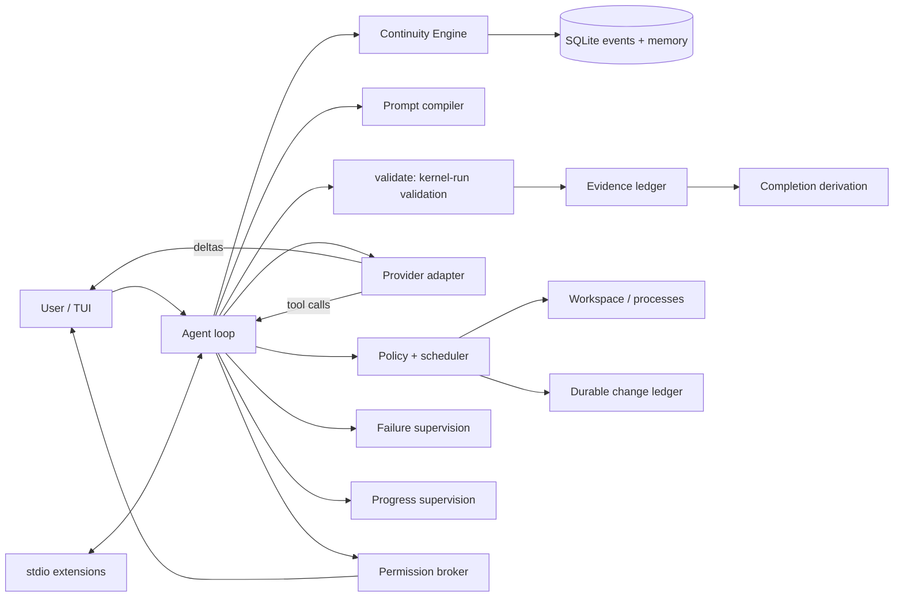

# Architecture

| Crate | Responsibility |
|---|---|
| `latch-protocol` | Events, task/memory/evidence records, provider and extension types, shared display formatting |
| `latch-kernel` | Store, continuity, prompts, policy, tools, providers, extensions, validation/evidence, failure and progress supervision, permissions, token estimation, loop, session resume |
| `latch-tui` | Typed transcript, slash palette, input editor, prompt history, semantic rendering |
| `latch-cli` | Configuration, resume orchestration, provider setup, slash-command coordination |

## The V0.1.1 shift: models express validation intent, the kernel owns truth

The model names what must hold — `validate {"requirement": "existing unittest
passes", "command": "python3 -B -m unittest test_calc -v"}` — and the kernel
does everything else: it executes the command under shell policy, appends a
`ValidationResult` event, creates or supersedes evidence for the requirement
with the real source event recorded internally, registers the requirement, and
derives completion. The model never supplies or sees an internal event id,
call id, or ledger id. `record_evidence` remains for non-command claims but
accepts only `pending` and `unavailable`; `passed`/`failed` statuses are
kernel-owned, so a model cannot self-certify.

Evidence is a current-state ledger: the newest entry per claim is the current
evidence; earlier entries stay in durable history. A validation that failed and
now passes supersedes the failure. Completion is derived, never declared:
`InProgress` until the model claims implementation, then `Verified` when every
required validation has current passing evidence, `Blocked` when a required
validation is unavailable, and `ImplementedNotVerified` otherwise.

## State, memory, and supervision

Model `task_update` constraints are `TaskConstraint` memory; only actual user
messages create `UserConstraint` provenance. Hypotheses are rejected or stay
hypotheses — a rejected hypothesis is never promoted to a decision. Decisions,
task constraints, and open questions have deterministic supersession/resolution
so canonical current state stays clean while raw events and memory records
retain history.

Failure supervision tracks a streak per validation lineage (requirement, or
shell command). Successful inspection tools never reset it; the lineage's own
validation passing resolves it, and a materially different failure signature
restarts the count. Streaks replay from durable events, so `--resume` does not
forget a stalled loop. At the configured budget the kernel requests re-ground.

Progress supervision is separate and deterministic: every read_file, search,
read_artifact, git_status, git_diff, and conservative read-only shell
observation is keyed by canonical subject (including range arguments) plus
result digest, scoped to a progress epoch. Workspace mutations (Latch, shell,
or detected external), new validation/evidence, meaningful task-state changes,
mode switches, and new user turns advance the epoch, so legitimate re-reads
after real change are never confused with redundancy. Consecutive turns that
only repeat unchanged observations cross the stagnation budget, at which point
the kernel injects a re-ground instruction listing exactly what is already
known; repeats after that are suppressed with a synthetic terminal result
instead of spending a tool cycle. Supervision state replays from durable
events, so live and `--resume` behavior are identical.

There is no fixed model-turn ceiling. `failure.max_model_turns` is an optional,
off-by-default circuit breaker for operators; long productive tasks are
governed by the stagnation and failure supervisors, not by count.

Important lifecycle transitions append to SQLite. Streaming token deltas are
transient. Operations are marked running before execution and complete
afterward; resume surfaces an unfinished record as uncertain.

Read-only batches execute concurrently. A mutation lock serializes edits,
writes, checkpoints, and undo. Shell and validation processes use bounded
timeout, cancellation, captured status, and artifact spill for large output.
Managed `exec_*` processes are owned by the kernel, buffered in memory, spilled
to artifacts past a cap, and durably closed with `ProcessExited`; a resumed
session reports honestly that children did not survive the restart.

## Context budgeting

Context is token-native. `latch-kernel::tokens::TokenEstimator` is a
conservative, provider/model-aware estimator (ASCII ~4 chars/token,
punctuation ~2, wide CJK/emoji characters priced explicitly); all pre-request
numbers are estimates, and provider-reported usage is authoritative after a
request. `ContextStats` records instructions, canonical state, recent
transcript, recall, tool schemas, and extension context, plus the model's
context window, reserve, and headroom. The context window defaults to 256k
tokens and is overridable per model (`[models.<name>] context_window_tokens`).
The continuity engine receives a `MaterializeBudget` that already subtracts
tool/extension costs, and the agent recomputes totals from the exact
components, so recalled material is counted once.

## Human approval

`PolicyEngine` can return `Ask`. The agent routes it through
`PermissionBroker`: a durable `PermissionRequested` event is appended, the turn
pauses, and exactly one human resolution from the TUI resolves it.
Approvals are single-use, keyed by kernel call id (never model-supplied), and
approved outside-workspace writes execute under the normal guarded-write path.
Non-interactive sessions record `non_interactive` denials; resume marks
unresolved requests `resume_expired`.

## Change ledger and shell drift

Latch- and shell-owned changes persist across restarts: pre-change bytes go to
content-addressed artifacts referenced by `FileChanged` events, and
`ChangeReverted` tombstones keep a resumed ledger from re-applying undone
work. `/undo` peeks before popping, restores only when the file still matches
the recorded post-change hash, and refuses otherwise. Workspace drift around
shell commands is classified honestly: Git workspaces get reversible `Shell`-owned
records where pre-content was capturable (captured dirty files, or the HEAD
blob for previously clean files) and explicit non-reversible markers otherwise;
non-Git workspaces get an honest "detection unavailable" marker. Pre-existing
dirty work is captured at startup and never conflated with Latch's changes.

## Providers

OpenAI-compatible chat completions and Anthropic Messages translate only at the
API boundary. Durable state remains provider-neutral. Assistant reasoning
(`reasoning_content`) is persisted and replayed verbatim by reasoning-capable
endpoints (DeepSeek, OpenCode Go) through a small wire profile; replay is
decoupled from tool-call structure so a defensive history transform can never
drop required reasoning state. Reasoning is never displayed in the transcript.
Repository instruction precedence is `CLAUDE.md`, `AGENTS.md`, then
`.latch/instructions.md`; current user input follows them. Kernel invariants
override project text.

## TUI state surfaces (V3.1)

The transcript explains activity; a responsive right sidebar explains state.
The sidebar reducer (`latch-tui::sidebar`) consumes the same durable events as
the semantic transcript, so live and resumed sessions agree: `ContextStats`
for the bounded working set, `TaskStateUpdated`/`EvidenceCreated` for
kernel-owned completion, `ModelUsage` for provider-neutral input/output and
optional cache categories (unknown stays `—`), and
`FileChanged`/`ChangeReverted`/`ExternalFileChangeDetected`/`ShellMutationObserved`
for Latch / Shell / Extension / External ownership. Optional user-configured
`[models.<name>.pricing]` yields a clearly labeled estimated cost; missing
components stay unavailable. The kernel forwards tool-appended durable events
to the live sink so live and replay observe identical event order.

The composer (`latch-tui::composer`) is a real editor rather than a text field:
the complete buffer is wrapped into grapheme-safe visual rows, an independent
viewport offset tracks the visible window, and the terminal cursor is placed
only while its visual row is visible. PageUp/PageDown move through an
overflowing prompt and fall back to transcript scrolling when it fits; the
wheel routes by pointer position. Layout chrome (footer, spacer, hints, gap,
metadata) drops before the editor body shrinks, so the prompt stays usable on
narrow or short terminals.

Diffs are first-class: `git_diff` completions become a typed
`DiffDocument` (parser in `latch-tui::diff`) rendered with restrained semantic
colors. Red/green semantics only ever apply inside a parsed unified diff;
unparsed input falls back to raw, uncolored lines. `/diff` opens a full-width
inspector with independent scrolling, temporary sidebar collapse, and a raw
toggle. A sidebar is shown at ≥110 columns (roughly 24–32%, clamped 28–44),
toggles with Ctrl+B or `/sidebar`, and collapses cleanly on narrow terminals.

## Resume

`--resume` is a user-level resume: the visible transcript replays from durable
events through the same formatter the live TUI uses (no reasoning, context
statistics, model usage, or raw task state), the effective mode resolves as
CLI `--mode` > the session's durable mode history > config default, prompt
history is rebuilt from user events, and task state, evidence, failure
streaks, progress supervision, and change ownership are restored without
re-executing anything or appending duplicate durable events. When the original
user prompt rotates out of the recent byte budget, the transcript is anchored
with a deterministic kernel continuation message rather than dropped, so a
mid-task window never gives the model amnesia.
