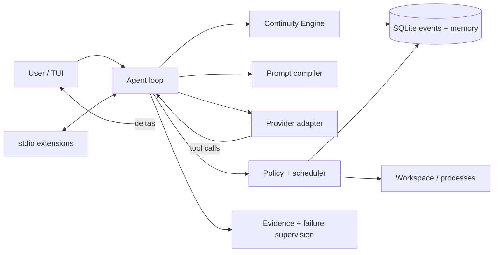

# Architecture

| Crate | Responsibility |
|---|---|
| `latch-protocol` | Events, task/memory/evidence records, provider and extension types |
| `latch-kernel` | Store, continuity, prompts, policy, tools, providers, extensions, supervision, loop |
| `latch-tui` | Dense transcript, status line, input, semantic rendering |
| `latch-cli` | Configuration, resume, provider setup, slash-command coordination |

Important lifecycle transitions append to SQLite. Streaming token deltas are
transient. Operations are marked running before execution and complete afterward;
resume surfaces an unfinished record as uncertain.

Read-only batches execute concurrently. A mutation lock serializes edits,
writes, checkpoints, and undo. Shell processes use bounded timeout, cancellation,
captured status, and artifact spill for large output.

OpenAI-compatible chat completions and Anthropic Messages translate only at the
API boundary. Durable state remains provider-neutral. Repository instruction
precedence is `CLAUDE.md`, `AGENTS.md`, then `.latch/instructions.md`; current user
input follows them. Kernel invariants override project text.
